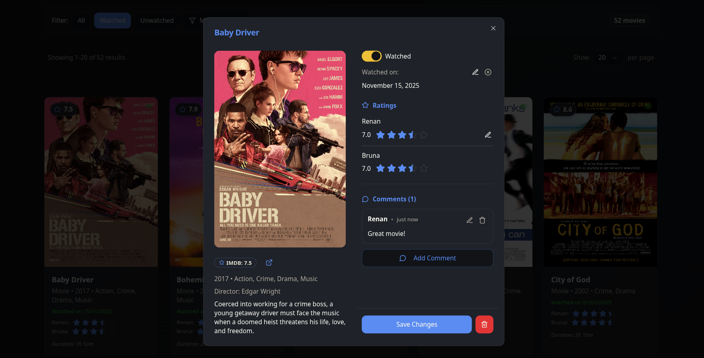

# AfterCredits

This project consists of a web app to register, rate and comment on the movies/series that you and your beloveds/family/friends have seen together, based mainly on the IMDb API.

It's currently under development, and it lacks most of the features related to creating/editing groups/users. 

The main idea is to allow users to create groups, and within these private groups, you can register when you watched a movie and share your opinions and ratings. In the future, it will also display metrics such as which categories or years of movies you have watched the most.

This repository consists of the frontend, with the backend image being pulled from Docker Hub ([lealre/aftercredits-backend](https://hub.docker.com/repository/docker/lealre/aftercredits-backend/general)).

It uses MongoDB as the database and [Golang for the backend](https://github.com/lealre/aftercredits-backend).

